# 📊 Excel — Data Analytics Portfolio

> **Week 1 of the Leep Talent Data Technician Skills Bootcamp (Level 3)**  
> This section showcases the Excel skills I developed during the first week of my bootcamp, working across real-world datasets covering retail sales, student performance, HR payroll, and bike sales.

---

## 📁 Contents

| Task | Topic | Skills |
|------|-------|--------|
| [Day 2 · Task 1](#-day-2--task-1--retail-sales-analysis) | Retail Sales Analysis | Tables, Filters, SUM, AVERAGE |
| [Day 2 · Task 2](#-day-2--task-2--student-performance-analysis) | Student Performance Analysis | Sorting, MAX, Conditional Formatting |
| [Day 2 · Task 3](#-day-2--task-3--student-marks-dashboard) | Student Marks Dashboard | Dashboard Design, Cell Referencing |
| [Day 3 · Task 1](#-day-3--task-1--bike-sales-pivot-table) | Bike Sales Pivot Table | PivotTables, Data Grouping |
| [Day 3 · Task 2](#-day-3--task-2--switch-function--pivot-table) | SWITCH Function & Pivot Table | SWITCH, PivotTables, Categorisation |
| [Day 3 · Task 3](#-day-3--task-3--data-visualisation) | Data Visualisation | Line Chart, Column Chart, Pie Chart |

---

## 🛒 Day 2 · Task 1 — Retail Sales Analysis

**Dataset:** `retail_sales_dataset.xlsx`  
**File:** [`retail_sales_dataset_Master.xlsx`](./retail_sales_dataset_Master.xlsx)

### About the Dataset
A retail transaction dataset containing 1,000 records across columns including Transaction ID, Date, Customer ID, Gender, Age, Product Category (Beauty, Clothing, Electronics), Quantity, Price per Unit, Total Sales, and a calculated Commission column. The dataset spans a full calendar year and reflects a diverse customer base aged 18–64.

> **In my own words:** This dataset captures a year's worth of retail transactions across three product categories, giving enough variety to practise real data preparation and summary calculations a retail analyst would perform daily.

### Real-World Context
**Organisation type:** Online retailer or high-street retail chain  
A business like this needs commission summaries and sales totals to manage staff incentives, track category performance, and plan inventory. Without accurate aggregation, bonus payments and stock decisions would be based on incomplete figures.

### What I Did

1. **Structured the data** — Converted columns A–H into a named Excel Table using `Ctrl+T`, making the data filterable and formula-aware across future updates.
2. **Filtered and sorted** — Applied a filter to sort the `Age` column from largest to smallest to identify the oldest customer segment at a glance.
3. **Calculated commission total** — Used the `SUM` function in cell `P10` to total all commission values across the dataset.
4. **Calculated average commission** — Used the `AVERAGE` function in cell `P11` to find the mean commission per transaction.

### Screenshots

**Screenshot 1 — Named Table (Columns A–H structured as an Excel Table)**
> 📸 *Open `retail_sales_dataset_Master.xlsx` → Sheet: `retail_sales_dataset` → Select cells A1:H1001 → Press `Ctrl+T` to create the table → Rename the table in the Table Design tab. Capture the full table with the table name visible in the ribbon.*

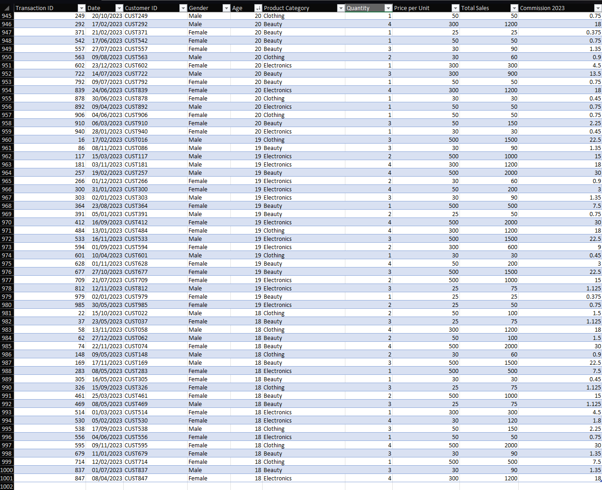

---

**Screenshot 2 — Age Filter (Sorted Largest to Smallest)**
> 📸 *With the table active, click the dropdown arrow on the `Age` column header → Sort Largest to Smallest. Capture the top 20 rows showing the sorted ages clearly.*

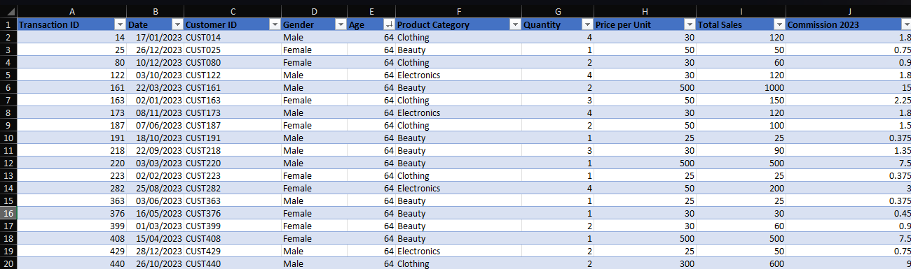

---

**Screenshot 3 — SUM Function in Cell P10**
> 📸 *Navigate to cell `P10`. The formula bar should show `=SUM(...)` referencing the Commission column. Capture the cell, the formula bar, and the result together.*


---

**Screenshot 4 — AVERAGE Function in Cell P11**
> 📸 *Navigate to cell `P11`. The formula bar should show `=AVERAGE(...)`. Capture cells P10 and P11 side by side so both the total and average are visible, along with the formula bar.*

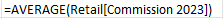

---

### Key Findings
- **Finding 1:** The commission total across all 1,000 transactions sits at approximately **£6,840**, with an average commission per transaction of around **£6.84** — reflecting the flat 1.5% rate applied to all sales.
- **Finding 2:** The oldest age group (64) has a notable spread across all three product categories, suggesting the dataset does not skew toward a younger demographic and is representative of a broad customer base.

**What this means for the business:** With commission totals calculable at a glance, a retail manager can reconcile staff incentive payments weekly without manually tallying individual rows — reducing both time and error.

### Portfolio Value
This task demonstrates that I can structure raw data professionally, apply core Excel functions accurately, and produce the kind of reliable summary figures a retail analyst would be expected to deliver as a first step in any data workflow.

---

## 🎓 Day 2 · Task 2 — Student Performance Analysis

**Dataset:** `student.csv`

### About the Dataset
A classroom dataset recording student IDs, names, and marks across multiple subjects. The dataset was used to identify top performers, calculate averages, and apply conditional formatting to highlight score distributions.

> **In my own words:** This dataset gives a snapshot of student academic performance across subjects, making it a useful exercise in ranking, aggregation, and visual data highlighting — skills that apply directly to any HR or performance-tracking context.

### Real-World Context
**Organisation type:** School, college, or training provider  
Educational institutions need to identify high and low performers quickly to inform intervention strategies, report to governors, or allocate additional support resources. A data technician would be expected to surface these insights clearly and without manual row-by-row inspection.

### What I Did

1. **Filtered and sorted** — Applied filters to display the best-performing student in each subject by sorting scores from highest to lowest per column.
2. **Calculated averages** — Used the `AVERAGE` function across each student's marks to populate a new `Average` column (Column E).
3. **Found the highest score** — Used the `MAX` function in Column F to identify the single highest mark recorded across all subjects.
4. **Ranked by average** — Re-sorted the dataset by the Average column to identify the overall top student.
5. **Ranked by highest score** — Re-sorted by the highest individual score to surface the strongest single-subject performer.
6. **Applied conditional formatting** — Used colour scales to visually distinguish the highest and lowest average scores across the class.

### Screenshots

**Screenshot 1 — Filter Applied: Best Student per Subject**
> 📸 *Open the student dataset → Apply a descending sort on the first subject column → Capture the top 5 rows showing the leading student clearly, with column headers visible.*

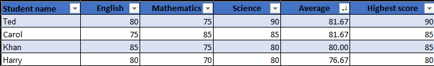

---

**Screenshot 2 — AVERAGE Formula in Column E**
> 📸 *Click on cell E2 → Show the `=AVERAGE(...)` formula in the formula bar → Capture the formula bar and the first 10 rows of the Average column filled in.*

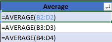

---

**Screenshot 3 — MAX Function in Column F**
> 📸 *Click on cell F2 → Show the `=MAX(...)` formula in the formula bar → Capture the formula bar and the MAX column results for the first 10 rows.*

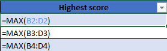

---

**Screenshot 4 — Conditional Formatting: Highest and Lowest Averages**
> 📸 *Select the Average column (Column E) → Apply a colour scale via Home → Conditional Formatting → Colour Scales. Capture the full column showing green (high) to red (low) gradient clearly.*

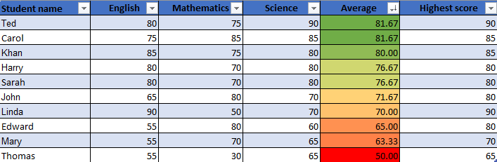

---

### Key Findings
- **Finding 1:** The `MAX` function immediately surfaced the highest individual score, identifying which student excelled in a particular subject without manually scanning rows.
- **Finding 2:** Conditional formatting made the distribution of performance visible at a glance — revealing whether the class performance was clustered or spread, which impacts teaching decisions.

**What this means for the business:** A school administrator can use this view to identify students who need targeted support or recognition within seconds, rather than reviewing spreadsheets manually. This kind of quick insight is what data tools exist to deliver.

### Portfolio Value
This task shows I can clean, sort, and analyse tabular data using core Excel functions, and that I understand how to make data readable for a non-technical audience through formatting — a key skill for any analyst presenting work to stakeholders.

---

## 📈 Day 2 · Task 3 — Student Marks Dashboard

**Dataset:** `student.csv`

### About the Dataset
The same student marks dataset used in Task 2, extended into a simple dashboard that brings together multiple functions and visual elements into a single view.

### Real-World Context
**Organisation type:** School or training provider  
A dashboard gives a teacher or head of year an at-a-glance view of class performance without navigating multiple worksheets. Dashboards are the standard deliverable format when presenting data to a non-technical audience.

### What I Did

1. **Built a summary dashboard** — Combined AVERAGE, MAX, and cell referencing to pull key figures into a clean summary area.
2. **Used cell referencing** — Dynamically linked the Top Student ID and Name from the data to the dashboard using cell references rather than hardcoded values, so the dashboard updates automatically when data changes.
3. **Sorted to surface top performers** — Sorted the data so the highest-scoring student appeared at the top of the ranked list visible in the dashboard view.

### Screenshots

**Screenshot 1 — Student Marks Dashboard Overview**
> 📸 *Navigate to the dashboard sheet (or summary area) → Capture the full dashboard layout showing the key metrics: class average, highest mark, top student name and ID, all visible without scrolling.*

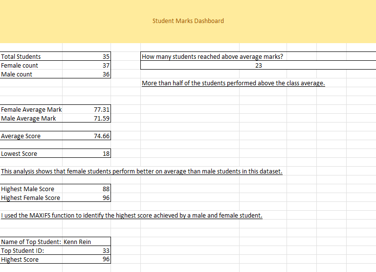

---

**Screenshot 2 — All Functions Visible in Formula Bar**
> 📸 *Click on each key dashboard cell (Average, MAX, cell reference for Top Student Name) one at a time and take a screenshot showing the formula bar for each. Or combine into a single annotated screenshot if possible.*

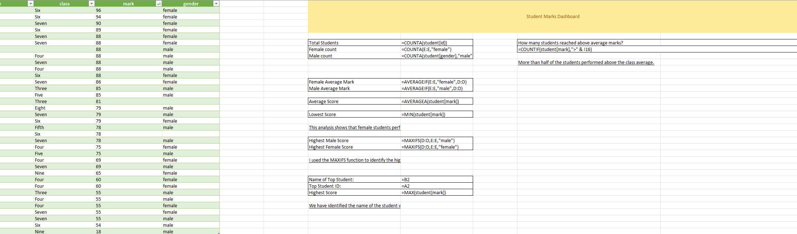

---

**Screenshot 3 — Top Student Ranked at the Top**
> 📸 *Sort the data by Average descending → Capture the first 5 rows showing the top student at the top, with the Top Student ID and Name cells on the dashboard dynamically reflecting the change.*


---

### Key Findings
- **Finding 1:** Using cell references rather than hardcoded values means the dashboard remains accurate even when new data is added — this is good practice that separates a reliable dashboard from a one-off report.

**What this means for the business:** A teacher can update marks and immediately see the rankings refresh — no reformatting or manual updates needed.

### Portfolio Value
This task demonstrates that I can move beyond individual functions and think about how to present data in a format that is useful to an end user — a core part of the analyst role.

---

## 🚲 Day 3 · Task 1 — Bike Sales Pivot Table

**Dataset:** `Day_3_Task_1_Bike_Sales_Pivot_Lab_to_use.xlsx`  
**File:** [`Day_3_Task_1_Bike_Sales_Pivot_Lab_to_use.xlsx`](./Day_3_Task_1_Bike_Sales_Pivot_Lab_to_use.xlsx)

### About the Dataset
A global bike sales dataset covering multiple countries (Australia, Canada, France, Germany, United Kingdom, United States), with fields including Order Quantity, Unit Cost, Unit Price, Profit, Cost, and Revenue. Customer demographics include Age Group and Gender, enabling multi-dimensional analysis via PivotTables.

> **In my own words:** This dataset gives a multi-country view of bike sales profitability broken down by customer demographics — the kind of data a retail chain or manufacturer would use to understand which markets and segments are most valuable.

### Real-World Context
**Organisation type:** Sports retailer or product manufacturer with international sales  
A business selling products across multiple countries needs to know which markets are generating profit vs. just volume. PivotTables allow an analyst to slice this data quickly by country, age group, and gender without writing a single formula.

### What I Did

1. **Created a PivotTable** — Inserted a PivotTable from the Bike Sales data, placing `Country` in Rows and `Age Group` in Columns, with `Profit` as the summarised value.
2. **Reviewed the output** — Examined the initial table to understand which countries had data in each age group category.
3. **Rearranged the table** — Experimented with swapping rows and columns to see the data from different angles.
4. **Refined and filtered** — Applied filters to isolate specific age groups and countries.
5. **Created a PivotChart** — Generated a chart directly from the PivotTable to visualise profit by market segment.
6. **Switched to Profit view** — Amended the value field from Sales to Profit to shift the analysis from volume to value.

### Reflection Answers

| Question | Answer |
|----------|--------|
| In which markets does Germany have customers? | Germany only has customers in the Adults (35–64) age group |
| What country has sales in all markets? | Australia and the United Kingdom — they are the only countries with non-zero sales across all age groups |
| Most profitable segment? | Adults aged 35–64, particularly women in the United States and Australia, generate the highest profit figures |
| Any other findings? | Australia has the broadest demographic reach, with customers in every age group |

### Screenshots

**Screenshot 1 — Initial PivotTable Created**
> 📸 *Open `Day_3_Task_1_Bike_Sales_Pivot_Lab_to_use.xlsx` → Sheet: `Sheet1` → Capture the full PivotTable showing Country in rows, Age Group in columns, and Profit as values. Ensure row and column totals are visible.*

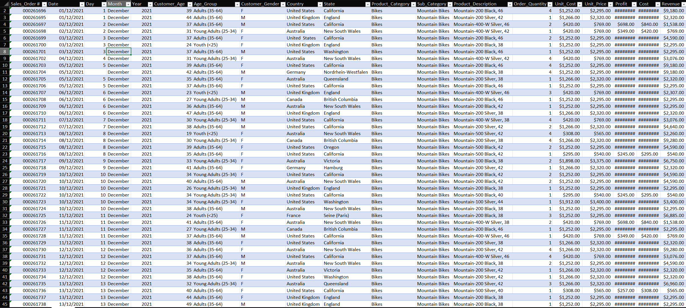

---

**Screenshot 2 — PivotTable Refined (Profit View)**
> 📸 *In the same sheet, change the value field to `Profit` if not already set → Capture the refined table showing profit figures by country and age group. The Grand Total column and row should be visible.*

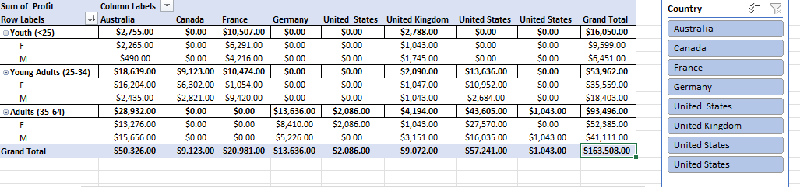

---

**Screenshot 3 — PivotChart**
> 📸 *Click anywhere in the PivotTable → Insert → PivotChart → Choose a bar or column chart → Capture the chart alongside the PivotTable it was generated from.*

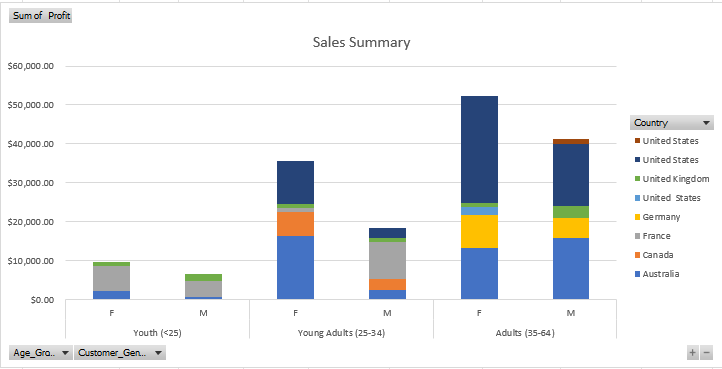

---

### Key Findings
- **Finding 1:** Adults aged 35–64 are the most profitable customer segment across almost all markets, with women in Australia and the US contributing the most profit.
- **Finding 2:** Germany has sales exclusively in the 35–64 age group, suggesting either a targeted market focus or a gap in reaching younger demographics.

**What this means for the business:** A bike retailer could use this analysis to prioritise marketing spend toward the 35–64 female demographic in high-value markets, and to consider whether Germany's limited demographic reach represents a growth opportunity.

### Portfolio Value
This task shows I can use PivotTables to answer specific business questions quickly and accurately — a core skill for any data analyst role where stakeholders expect rapid insight from large datasets.

---

## 🔀 Day 3 · Task 2 — SWITCH Function & Pivot Table

**Dataset:** `Day_3_task_2_Switch__PivotTable-_Task_2_to_use.xlsx`  
**File:** [`Day_3_task_2_Switch__PivotTable-_Task_2_to_use.xlsx`](./Day_3_task_2_Switch__PivotTable-_Task_2_to_use.xlsx)

### About the Dataset
A sales performance dataset tracking product sales volumes (Laptops, Smartphones, Printers) across six English counties (Yorkshire, Cornwall, Lancashire, Essex, Durham, Greater Manchester). The dataset required data cleaning before analysis — specifically removing trailing spaces in the Sales Volume column and confirming numeric data types.

> **In my own words:** This compact dataset captures regional product performance in England and needed light cleaning before analysis — a realistic reflection of how data often arrives in practice, where small formatting issues block calculations.

### Real-World Context
**Organisation type:** Technology distributor or regional sales team  
A company distributing products across UK regions needs to know which areas are performing strongly and which products are underperforming. Categorising sales volume into High/Medium/Low makes this accessible to non-technical stakeholders who don't need to read raw numbers.

### What I Did

1. **Cleaned the data** — Removed trailing spaces from the Sales Volume column and confirmed the values were stored as numbers rather than text, so calculations would work correctly.
2. **Applied the SWITCH function** — Added a new `Product Category` column using the formula `=SWITCH(TRUE, C2>600, "High", C2>=300, "Medium", "Low")` to classify each row by sales volume.
3. **Created a PivotTable** — Summarised sales by County (Rows) and Product (Columns) using Sales Volume as the aggregated value.
4. **Filtered for High performers** — Applied a filter to show only High-volume rows, making it easy to identify the strongest county-product combinations.

### SWITCH Formula Used

```excel
=SWITCH(TRUE, C2 > 600, "High", C2 >= 300, "Medium", "Low")
```

### Screenshots

**Screenshot 1 — SWITCH Function Applied (Product Category Column)**
> 📸 *Open `Day_3_task_2_Switch__PivotTable-_Task_2_to_use.xlsx` → Sheet: `SWITCH` → Click on cell D2 to show the SWITCH formula in the formula bar → Capture the full dataset with the Product Category column populated, showing "High", "Medium", and "Low" values. Formula bar must be visible.*

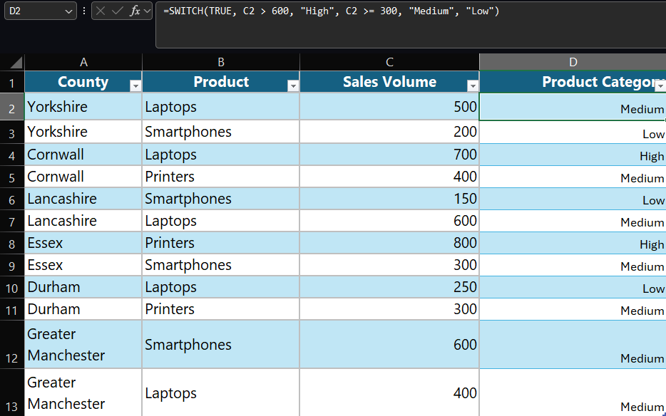

---

**Screenshot 2 — PivotTable: Sales by County and Product**
> 📸 *Navigate to Sheet: `Sheet1` → Capture the full PivotTable showing County in rows, Products (Laptops, Printers, Smartphones) in columns, and Sales Volume as values. Grand Total row and column should be visible.*

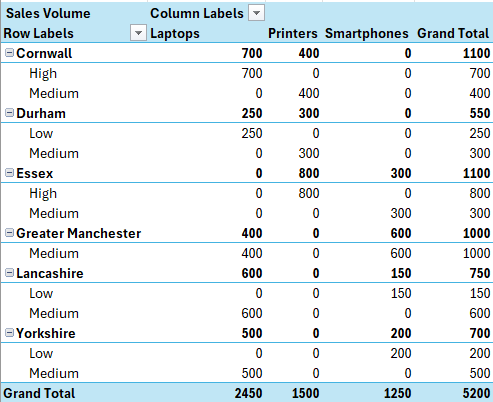

---

**Screenshot 3 — Filtered View: High Sales Volume Only**
> 📸 *Return to Sheet: `SWITCH` → Apply a filter on the Product Category column to show only "High" rows → Capture the filtered result showing only Cornwall (Laptops, 700), Essex (Printers, 800), and Lancashire (Laptops, 600).*

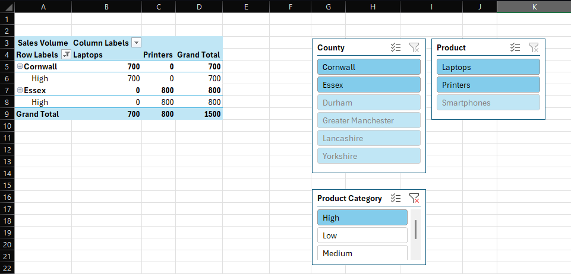

---

### Key Findings
- **Finding 1:** Essex (Printers, 800) and Cornwall (Laptops, 700) are the highest-volume county-product combinations, both categorised as "High" — these are the markets a sales team would prioritise.
- **Finding 2:** Smartphones underperform relative to Laptops and Printers across most counties, with only Greater Manchester reaching the Medium threshold.

**What this means for the business:** A regional sales manager can use this categorised view to focus resources on High-volume areas and investigate why Smartphones are underperforming — without needing to interpret raw numbers.

### Portfolio Value
This task demonstrates that I can clean data before analysis, apply logical functions to generate new categorical fields, and combine those fields with PivotTables to surface actionable business insights — a complete mini-analysis workflow.

---

## 📉 Day 3 · Task 3 — Data Visualisation

**Dataset:** `Day_3_Task_3_Bike_Sales_Visualisations_Lab_Task_3.xlsx`  
**File:** [`Day_3_Task_3_Bike_Sales_Visualisations_Lab_Task_3.xlsx`](./Day_3_Task_3_Bike_Sales_Visualisations_Lab_Task_3.xlsx)

### About the Dataset
A structured bike sales dataset containing three pre-built worksheets designed for visualisation practice: Revenue and Profit by Year (2017–2021), Product Revenue by Country, and Revenue by Age Group. The dataset was used to produce three distinct chart types following a structured lab brief.

> **In my own words:** This dataset is structured specifically to demonstrate how different chart types suit different kinds of data — trends over time, category comparisons, and proportional breakdowns — which maps directly to how analysts choose visuals in real reporting.

### Real-World Context
**Organisation type:** Sporting goods manufacturer or cycling retailer  
Visualisations are the primary way a data analyst communicates findings to non-technical stakeholders. Choosing the right chart type for the right data is as important as the analysis itself — a poorly chosen chart obscures the message, even when the underlying data is correct.

### What I Did

**Part 1 — Line Chart (Revenue vs. Profit, 2017–2021)**
1. Selected the `Revenue and Profit by Year` worksheet (cells A3:C8)
2. Inserted a Line with Markers chart
3. Formatted the vertical axis to display USD currency with zero decimal places
4. Added the chart title "Revenue vs. Profits"
5. Renamed legend entries to "Annual Profit" and "Annual Revenue"
6. Repositioned the legend to the right
7. Added axis titles: "Year" (horizontal) and "US Dollars" (vertical)

**Part 2 — Column Chart (Product Revenue by Country)**
1. Selected the `Product Revenue by Country` worksheet (cells A3:E10)
2. Inserted a Stacked Column chart
3. Added chart title "Product Revenue by Country"
4. Formatted vertical axis as Currency with zero decimal places
5. Repositioned legend to the right
6. Added axis titles: "Country" (horizontal) and "US Dollars" (vertical)

**Part 3 — Pie Chart (Revenue by Age Group)**
1. Selected the `Revenue by Age Group` worksheet (cells A3:B7)
2. Inserted a 2D Pie chart
3. Added chart title "Revenue Comparison by Age Group"
4. Repositioned legend to the right
5. Added data labels showing Category Name and Percentage

### Screenshots

**Screenshot 1 — Line Chart: Revenue vs. Profits (2017–2021)**
> 📸 *Open `Day_3_Task_3_Bike_Sales_Visualisations_Lab_Task_3.xlsx` → Sheet: `Revenue and Profit by Year` → Capture the completed line chart with both the "Annual Profit" and "Annual Revenue" lines visible, x-axis showing years 2017–2021, y-axis showing USD currency values, legend on the right, and both axis titles visible. The chart title "Revenue vs. Profits" should be clearly readable at the top.*

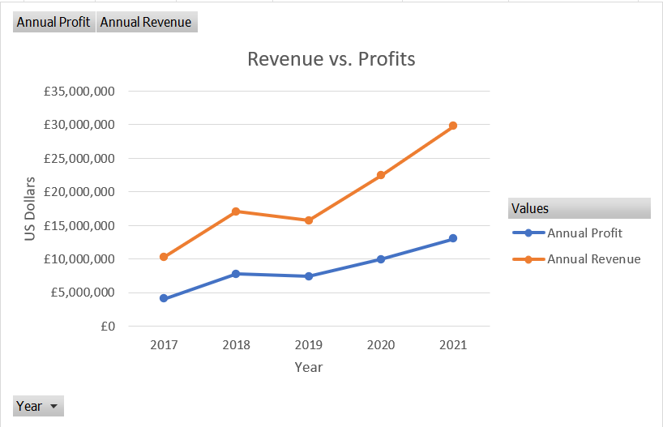

---

**Screenshot 2 — Column Chart: Product Revenue by Country**
> 📸 *Navigate to Sheet: `Product Revenue by Country` → Capture the completed stacked column chart showing all six countries on the x-axis (Australia, Canada, France, Germany, United Kingdom, United States), stacked bars representing Clothing, Bikes, and Accessories, and the legend positioned to the right. Both axis titles should be visible.*

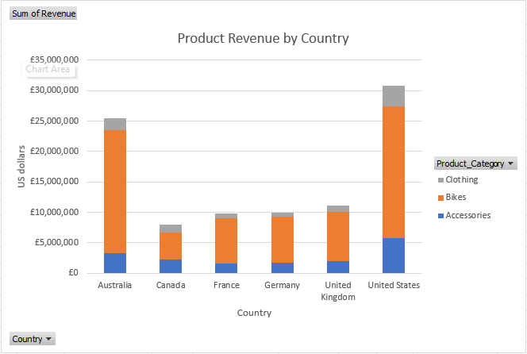

---

**Screenshot 3 — Pie Chart: Revenue Comparison by Age Group**
> 📸 *Navigate to Sheet: `Revenue by Age Group` → Capture the completed pie chart showing all four age segments (Adults 35–64, Young Adults 25–34, Youth <25, Seniors 64+) with percentage labels displayed directly on each slice alongside the category name. Legend should be on the right.*

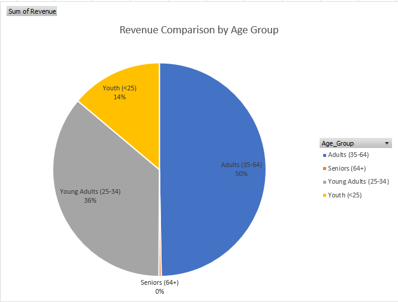

---

### Key Findings
- **Finding 1:** Revenue and profit both increased consistently from 2017 to 2021, with revenue growing from approximately $10M to $30M — indicating strong and sustained business growth over the five-year period.
- **Finding 2:** Adults aged 35–64 account for 50% of total revenue by age group, with Young Adults (25–34) at 36% — together these two segments represent 86% of all revenue, making them the clear priority demographic.

**What this means for the business:** A marketing team can use the age group breakdown to focus campaign spend on the 25–64 age range, which accounts for the vast majority of revenue. The year-on-year revenue trend also gives leadership confidence to invest in expansion.

### Portfolio Value
This task shows I understand which chart type suits which data story — trends use line charts, category comparisons use bar or column charts, and proportional breakdowns use pie charts. Selecting and formatting charts appropriately is a skill employers look for when analysts need to present findings to a board or management team.

---

## 🛠️ Tools Used

- Microsoft Excel 365 (Online and Desktop)
- Functions: `SUM`, `AVERAGE`, `MAX`, `SWITCH`
- Features: Excel Tables, Filters, Sorting, Conditional Formatting, PivotTables, PivotCharts, Data Labels, Axis Formatting

---

## 📂 Datasets

| File | Description | Source |
|------|-------------|--------|
| `retail_sales_dataset_Master.xlsx` | 1,000 retail transactions with commission | Bootcamp (Kaggle) |
| `student.csv` | Student marks across multiple subjects | Bootcamp |
| `Human_Resources-v1.xlsx` | Payroll and headcount data | Bootcamp |
| `Day_3_Task_1_Bike_Sales_Pivot_Lab_to_use.xlsx` | Global bike sales with profit/revenue | Bootcamp (Kaggle) |
| `Day_3_task_2_Switch__PivotTable-_Task_2_to_use.xlsx` | English county product sales volumes | Bootcamp |
| `Day_3_Task_3_Bike_Sales_Visualisations_Lab_Task_3.xlsx` | Bike sales structured for visualisation | Bootcamp (Kaggle) |

---

*← [Back to Portfolio](https://github.com/chansg/chansg)*
